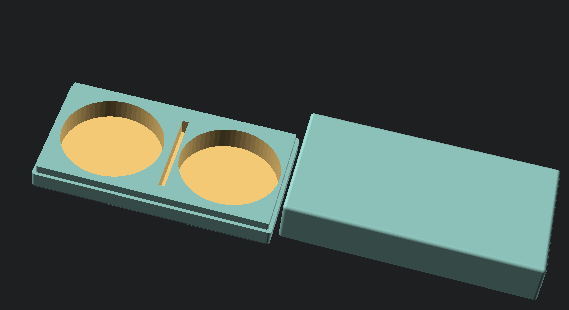

# Senseo tools

Collection of (1) tools for our Senseo coffee maker.

## Metal filter box

This uses the [box module](../../lib/README.md) to create a holder for
the [Senseo metal filter](https://www.ebay.co.uk/itm/313403577940) and
[coffee stamp](https://www.printables.com/model/203305-senseo-edelstahlpulverpad-einfullhilfe).

TBD: Add photo
